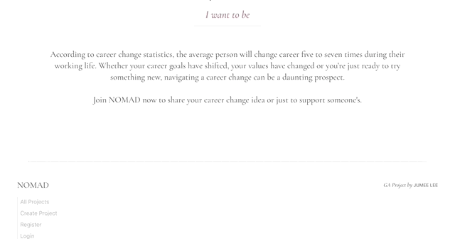
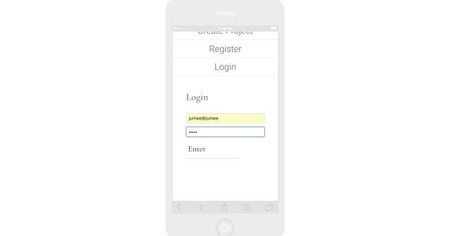
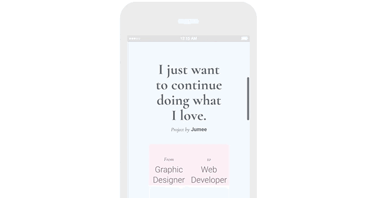

# Nomad

## GA Project 4
This was the fourth project during my time on the Web Development Immersive course (12 weeks of full-time) at General Assembly. The project took place in the week 12. [>>To the Site<<](https://nomad-ga.herokuapp.com/)

**Note**
The landing page may take longer than the average page load time.

#### Course Curriculum :

> **Week 10-11** | Module Four

- React
- JSX
- ES6

*Full curriculum available at the bottom of the page.*

***

## Brief
Build a MERN (MongoDB, Express, React, Node.js) stack web application.

> **Technical Requirements**
* Build a full-stack application.
* Use an Express API and Mongo database.
* Consume your API with a separate front-end built with React.
* Multiple relationships and CRUD functionality for at least a couple of models
* Be deployed online.

**Timeframe :** 1 week (December 2018)

## Concept
Users can create their own project to share their career change idea or simply just support someone's story by giving away points. Every projects has a goal points to achieve 0.
This application could develop into a crowdfunding project.


## Goal
Learning a new framework in 2 weeks is quite challenging.
After the third project using Angular, the course swiftly moved on to learn a new framework , React for another 2 weeks. I found this switch abstruse and I wanted to take the opportunity of the project week to understand the comprehensive concept and usage of React.
The project is on its first stage and will be continued as my side project.

## Visuals
**Home and Index**



**Project Show**



**Profile, Comment and Support**


**Goal achieved**



##### All features
> User can access to
- Home
- View all projects.
- Register

> Registered user can
- Log in and out.
- Create, edit and delete a project.
- Support points on the projects.
- Make comment on the projects and delete their own comments.
- Access to their profile page.
- The profile page shows the projects the user created, commented and gave support points.

## Project Log
#### Approach
| Time | Action |
| ---- |:------:|
| **1.5 day** | Project concept, code planning, wireframe |
| **3 days**| Server side work. Initial front end set up. |
| **2 days** | Client side work. Style / Scss. |
| **Half day** | Extra features, Bug fixing, Testing, Git, Deployment |

**Initial notes**


**Plan notes**


#### Challenges
I found Trello project management was more effective on a team
development. I spent longer time on planning and replanning then the last project and I found more easy to manage time and check status when I had a team member to work with. As you can see the Trello board is cleaner than the last.


There are more JavaScript fun in React.

Project schema virtuals.
```javascript
projectSchema.virtual('totalSupport')
  .get(function() {
    return this.supports.reduce((sum, support) => {
      return sum + support.amount;
    }, 0);
  });

projectSchema.virtual('remainder')
  .get(function() {
    return this.goal - this.totalSupport;
  });
```
#### Lessons learned
Group development vs individual development. Individual environment provided high concentration and focus but group work was also great for inspiration and to do more things and I found myself better at managing time because of responsibility.

## Bugs / Moving Forward
- Better UX / Redirect create project page if logged in.
- Limit and make support credit purchasable to support projects.
- Replace support points to currency.
- Add flash message on registration and log in errors.

## Technologies Used
| Category | List |
| ---- | --- |
| Languages                            | Javascript (ECMAScript6), CSS3, Sass, HTML5 |
| Front-end Web Application Framework / Library  | React |
| Server Environment                   | Node.js with Express.js |
| Project Collaboration Tool           | Trello, Slack |
| REST client                          | Insomnia |
| Typefaces                            | Google Fonts |
| Text Editor                          | Atom |
| Browser                              | Chrome |
| Version control | Git and GitHub

## License

[](http://badges.mit-license.org)

- **[MIT license](http://opensource.org/licenses/mit-license.php)**

***

## Course Curriculum
Please see below for the details of my training and links to more projects.

> **Week 1-3** | Module One

- HTML5
- CSS3 and CSS Animation
- Sass
- JavaScript
- jQuery

> **Week 4**

- *Project 1* : **Iguana vs Snakes** | [GitHub](https://github.com/Jumee-LDN/wdi-project-one) |
[Play Link](https://jumee-ldn.github.io/wdi-project-one/)

> **Week 5** | Module Two

- Node.js
- Express.js
- EJS
- MongoDB
- User Authentication

> **Week 6**

- *Project 2* : **hungry korilla** | [GitHub](https://github.com/Jumee-LDN/wdi-project-two) |
[Heroku](https://hungrykorilla.herokuapp.com/)

> **Week 7-8** | Module Three

- Angular
- Token Authentication & Session Authentication
- Third-party APIs
- Mocha and Chai

> **Week 9**

- *Project 3* : **xhibit** | [GitHub](https://github.com/Jumee-LDN/wdi-project-3) |
[Heroku](https://xhibit.herokuapp.com/#!/)

> **Week 10-11** | Module Four

- React
- JSX
- ES6

> **Week 12**

- *Project 4* : **Nomad** | [GitHub](https://github.com/Jumee-LDN/wdi-project-four) |
[Heroku](https://nomad-ga.herokuapp.com/)

***

## Contact
#### Jumee Lee
Email : jumeelee.london@gmail.com

[Portfolio](https://jumeelee.co.uk/) | [LinkedIn](https://www.linkedin.com/in/jumeelee/) | [GitHub](https://github.com/Jumee-LDN)
