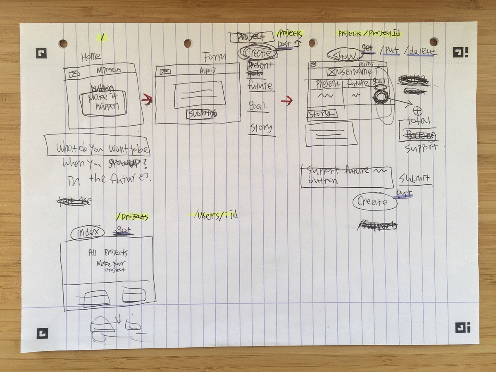
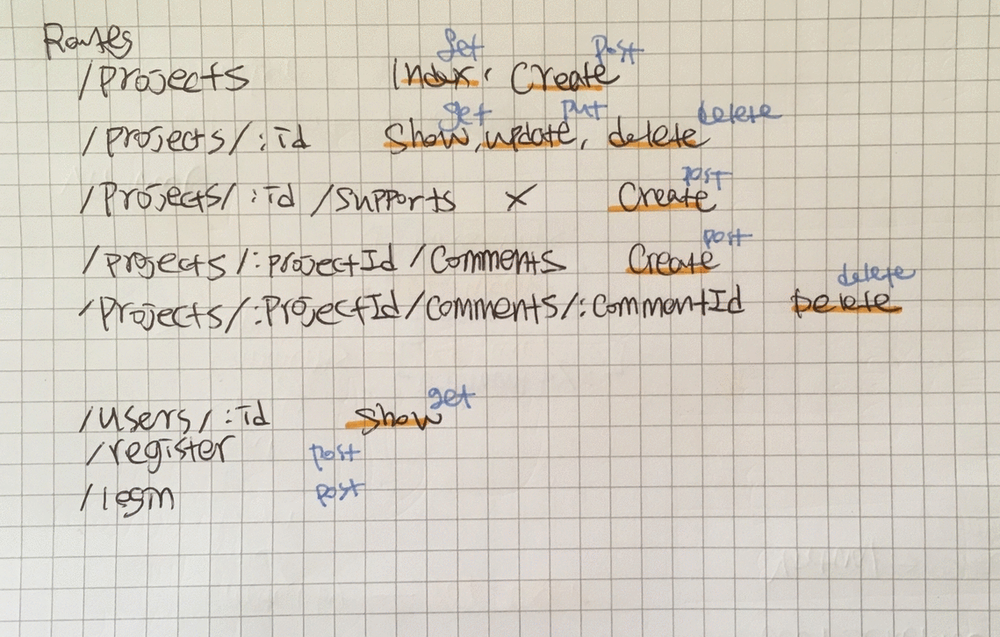

# Nomad

## GA Project 4
This was the fourth project during my time on the Web Development Immersive course (12 weeks of full-time) at General Assembly. The project took place in the week 12. [>>To the Site<<](https://nomad-ga.herokuapp.com/)

**Note**
The landing page may take longer than the average page load time.

#### Course Curriculum :

> **Week 10-11** | Module Four

- React
- JSX
- ES6

*Full curriculum available at the bottom of the page.*

***

## Brief
Build a MERN (MongoDB, Express, React, Node.js) stack web application.

> **Technical Requirements**
* Build a full-stack application.
* Use an Express API and Mongo database.
* Consume your API with a separate front-end built with React.
* Multiple relationships and CRUD functionality for at least a couple of models
* Be deployed online.

**Timeframe :** 1 week (December 2018)

## Concept
The last project.
## Goal

## Visuals



##### All features

## Project Log
#### Approach
#### Challenges
```javascript
projectSchema.virtual('totalSupport')
  .get(function() {
    return this.supports.reduce((sum, support) => {
      return sum + support.amount;
    }, 0);
  });

projectSchema.virtual('remainder')
  .get(function() {
    return this.goal - this.totalSupport;
  });
```
#### Lessons learned

## Bugs / Moving Forward
- Better UX / Redirect
-

## Technologies Used
| Category | List |
| ---- | --- |
| Languages                            | Javascript (ECMAScript6), CSS3, Sass, HTML5 |
| Front-end Web Application Framework / Library  | React |
| Server Environment                   | Node.js with Express.js |
| CSS Framework                        | Bulma |
| Third-party APIs                     | OpenStreetMap with Leaflet |
| Project Collaboration Tool           | Trello, Slack |
| REST client                          | Insomnia |
| Typefaces                            | Google Fonts |
| Text Editor                          | Atom |
| Browser                              | Chrome |
| Version control | Git and GitHub

## License

[](http://badges.mit-license.org)

- **[MIT license](http://opensource.org/licenses/mit-license.php)**

***

## Course Curriculum
Please see below for the details of my training and links to more projects.

> **Week 1-3** | Module One

- HTML5
- CSS3 and CSS Animation
- Sass
- JavaScript
- jQuery

> **Week 4**

- *Project 1* : **Iguana vs Snakes** | [GitHub](https://github.com/Jumee-LDN/wdi-project-one) |
[Play Link](https://jumee-ldn.github.io/wdi-project-one/)

> **Week 5** | Module Two

- Node.js
- Express.js
- EJS
- MongoDB
- User Authentication

> **Week 6**

- *Project 2* : **hungry korilla** | [GitHub](https://github.com/Jumee-LDN/wdi-project-two) |
[Heroku](https://hungrykorilla.herokuapp.com/)

> **Week 7-8** | Module Three

- Angular
- Token Authentication & Session Authentication
- Third-party APIs
- Mocha and Chai

> **Week 9**

- *Project 3* : **xhibit** | [GitHub](https://github.com/Jumee-LDN/wdi-project-3) |
[Heroku](https://xhibit.herokuapp.com/#!/)

> **Week 10-11** | Module Four

- React
- JSX
- ES6

> **Week 12**

- *Project 4* : **Nomad** | [GitHub](https://github.com/Jumee-LDN/wdi-project-four) |
[Heroku](https://nomad-ga.herokuapp.com/)

***

## Contact
#### Jumee Lee
Email : jumeelee.london@gmail.com

[Portfolio](https://jumeelee.co.uk/) | [LinkedIn](https://www.linkedin.com/in/jumeelee/) | [GitHub](https://github.com/Jumee-LDN)

#### India Derrick
[GitHub](https://github.com/indiaderrick)
